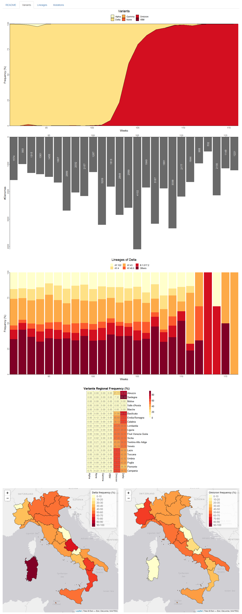

Graphical representation of data
--------------------------------

| Each tab of mapPat was designed to provide informative visuals of pathogens’ genomic data at different levels of geographic granularity, but applying a common layout to summarise key features of pathogen’s evolution.
| Data describing variants, lineages and mutations are represented using dedicated plots that allow to capture variations in their key evolutionary characteristics in space and time.
| Some of these plots serve a similar purpose in different tabs, while others are more specific and used to describe specific aspects of variants, lineages or mutations.

| Some of these plots serve a similar purpose in different tabs, while others are more specific and used to describe specific aspects of variants, lineages or mutations.
| Note that not all possible tabs are available for all pathogens analysed using mapPat. Specifically, the Variants Tab is produced only when SARS-CoV-2 is selected, since at present named variants were defined only for this pathogen.

