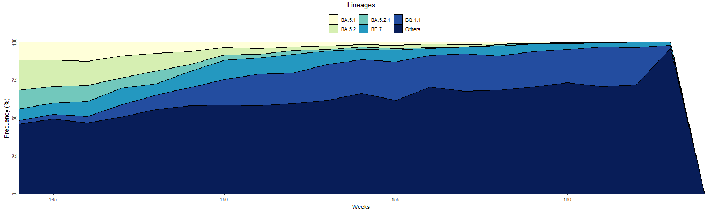
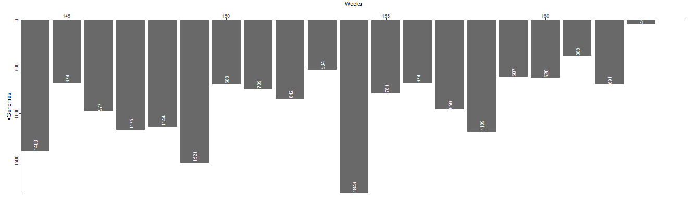
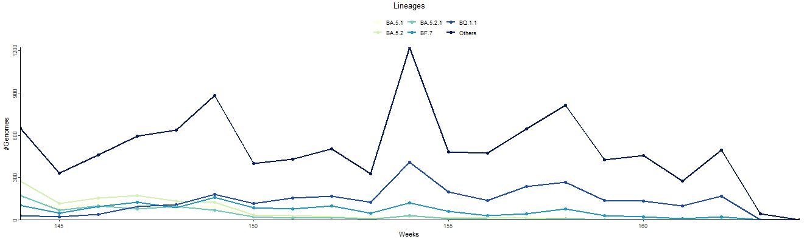
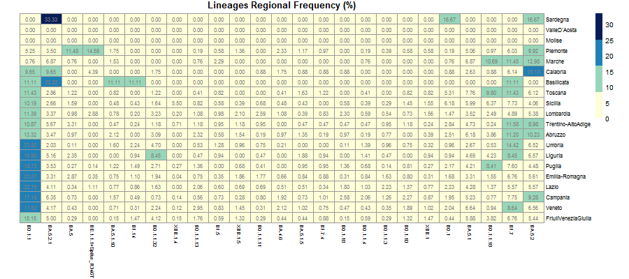
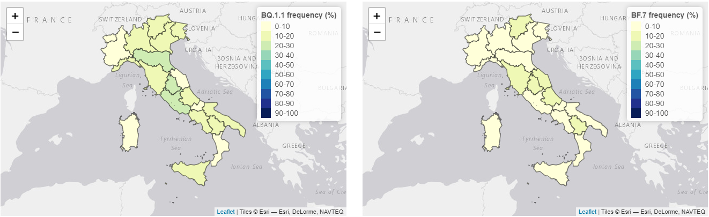

Lineages Tab
------------

| This Tab consists of five types of plots which describe the national and regional distribution of SARS-CoV-2 lineages over a time period of interest.
| The plot list includes:

+ **National frequency stacked area chart**
   | Describes the weekly variations in the national frequency (%) of lineages over a time period of interest. Frequency (%) is calculated as the ratio between the number of genomes for each lineage and the total number of sequenced genomes, both calculated at national level on a weekly basis.
   | Only lineages with a national cumulative frequency (%) above a certain threshold (see following section) are represented. Cumulative frequency (%) is calculated as the ratio between the number of genomes for each lineage and the total number of sequenced genomes, both calculated at national level on the whole time period of interest. Moreover, to make the representation more compact and easily readable the number of elements to be visualised on the chart is limited to the first nth nationally most frequent lineages surviving previous filters; n is a value set by the user.
   | All lineages not explicitly represented (either because they did not survive filters or they are not among the n most frequent lineages) are aggregated under the “Others” variable.

+ **Sequenced genomes barplot**
   Represents the total number of SARS-CoV-2 genomes sequenced on each week in a time frame of interest.

+ **Per lineage sequenced genomes scatterplot**
   | Describes the weekly variations in the number of sequenced genomes for a limited selection of lineages compared against the total number of genomes in the “Others” variable (see below) over a time period of interest.
   | Only lineages with a national cumulative frequency (%) above a certain threshold (see following section) are represented. Cumulative frequency (%) is calculated as the ratio between the number of genomes for each lineage and the total number of sequenced genomes, both calculated at national level on the whole time period of interest. Moreover, to make the representation more compact and easily readable the number of elements to be visualised on the chart is limited to the first nth nationally most frequent lineages surviving previous filters; n is a value set by the user.
   | All lineages not explicitly represented (either because they did not survive filters or they are not among the n most frequent lineages) are aggregated under the “Others” variable.

+ **Regional frequency heatmap**
   | Represents the global variation in the regional cumulative frequency (%) of lineages over a specific time frame. Cumulative frequency (%) is calculated as the ratio between the number of genomes for each lineage of interest and the total number of sequenced genomes, both calculated at regional level for the whole time period of interest.
   | Only lineages that present at least one sequenced genome are represented. Moreover, to make the representation more compact and easily readable the number of elements to be visualised on the chart is limited to the first 25 most frequent lineages surviving previous filters (limit set by the developer). Lineages to be represented are identified by their national cumulative frequency (%); for this purpose cumulative frequency (%) is calculated as the ratio between the number of genomes for each lineage and the total number of sequenced genomes, both calculated at national level for the whole time period of interest.

+ **Regional frequency choropleth map**
   | Describes the regional cumulative frequency (%) of a selected lineage over a time period of interest. Cumulative frequency (%) is calculated as the ratio between the number of genomes for the lineage of interest and the total number of sequenced genomes, both calculated at regional level for the whole time period of interest.
   | Only lineages with a national cumulative frequency (%) above a certain threshold (see following section) are represented. For the purpose of filtering cumulative frequency (%) is calculated as the ratio between the number of genomes for each lineage and the total number of sequenced genomes, both calculated at national level in the whole time period of interest.
   | Two choropleth maps, representing data for two different lineages, are available.

