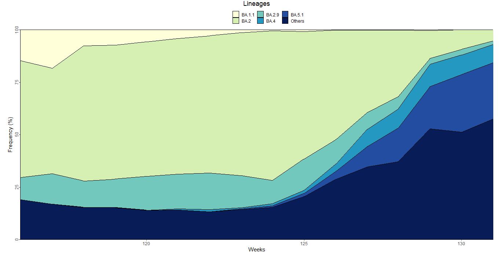
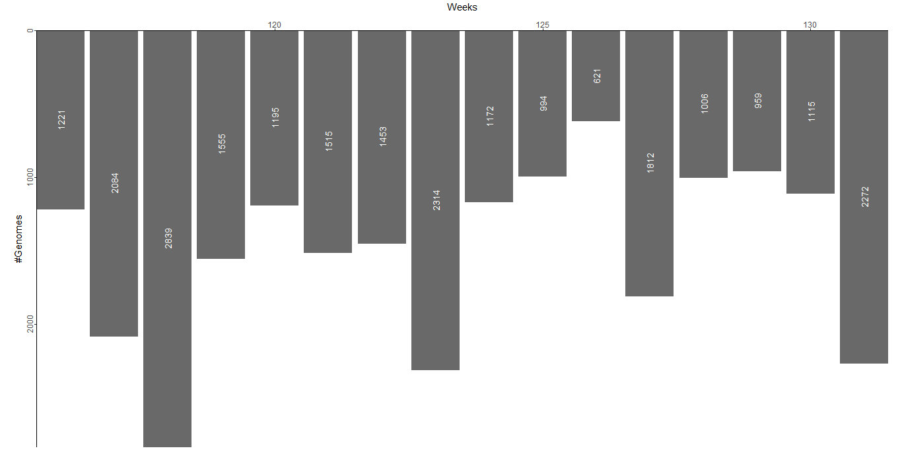
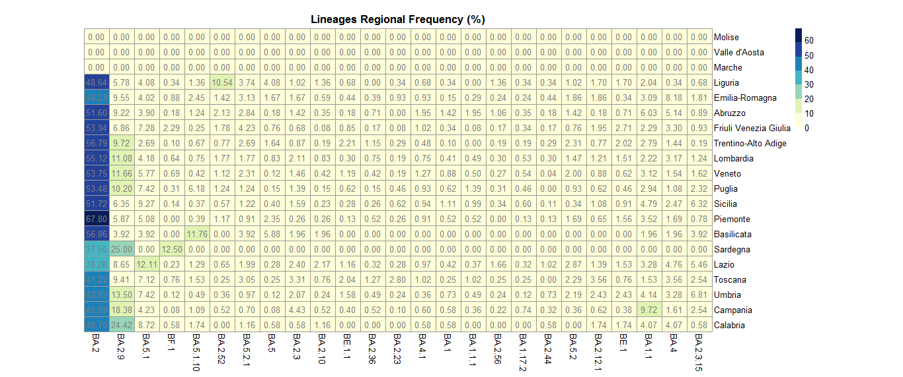

Lineages Tab
------------

This tab describes the national and regional distribution of lineages over a time period of interest.

+ **National frequency stacked area chart**
	| Describes variations in the pointwise frequency (%) of lineages.
	| Only lineages with a national global frequency (%) above a certain threshold are represented.
	| To make the representation more compact and easily readable only the first N most prevalent lineages (based on global frequency) are displayed; N is a value set by the user.
	| All lineages not explicitly represented are aggregated under the label “Others”.

+ **Sequenced genomes barplot**
	| Represents the total number of genomes sequenced weekly/monthly.

+ **Regional frequency heatmap**
	| Represents variations in the regional global frequency (%) of lineages.
	| Only lineages that present at least one sequenced genome are represented.
	| To make the representation more compact and easily readable the number of elements to be visualised on the plot is limited to the first 25 most prevalent lineages (based on national global frequency, limit set by the developer).

+ **Regional frequency choropleth map**
	| Illustrates variations in the regional global frequency (%) of a selected lineage.
	| Only lineages with a national global frequency (%) above a certain threshold are represented.
	| Up to two choropleth maps, representing data for two different lineages, are displayed.

.. figure:: _static/LinCM.png
   :scale: 50%
   :align: center
