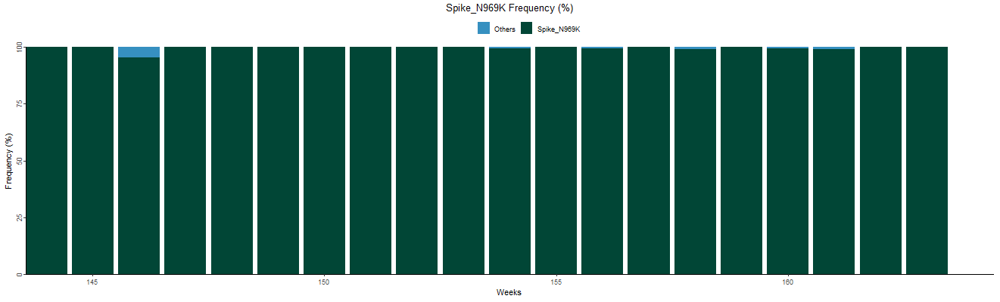
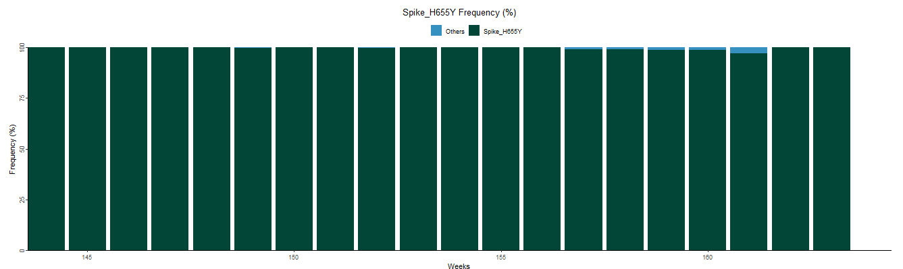
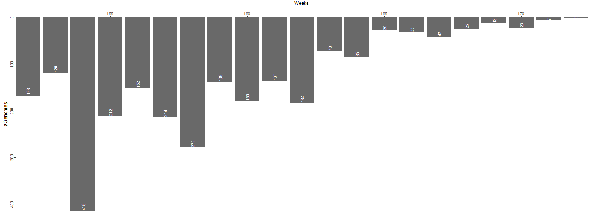
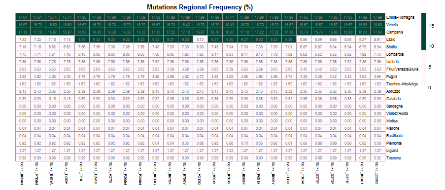
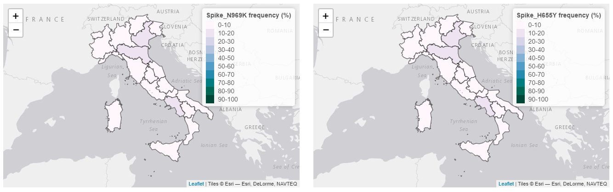

Mutations Tab
-------------

| This Tab consists of four types of plots which describe the national and regional distribution of SARS-CoV-2 mutations over a time period of interest. Mutations to analyse are selected among the non-defining mutations of a single lineage (selected by the user, see following section) among those surviving the national cumulative frequency (%) filter in the Lineages Tab (see above). Only mutations that appear in at least 10 sequences of the lineage of interest are included in the input data.
| The plot list includes:

+ **National frequency barplot**
   | Describes the weekly variations in the national frequency (%) of genomes from the lineage of interest with a certain mutation compared to the national frequency (%) of genomes of the same lineage without the mutation. Frequency (%) is calculated as the ratio between the number of genomes of the lineage of interest with the mutation and the total number of sequenced genomes for that same lineage, both calculated at national level on a weekly basis.
   | Two barplots, representing data for the two most frequent (%) mutations, are available. Mutations to be represented are identified by their national cumulative frequency (%). For this purpose cumulative frequency (%) is calculated as the ratio between the number of genomes for each mutation and the total number of sequenced genomes for the selected lineage, both calculated at national level for the whole time period of interest.

+ **Sequenced genomes barplot**
   Represents the total number of SARS-CoV-2 genomes sequenced for the user-selected lineage on each week in a time frame of interest.

+ **Regional frequency heatmap**
   | Describes the global variation in the regional cumulative frequency (%) of non-defining mutations of a lineage of interest over a specific time frame. Cumulative frequency (%) is calculated as the ratio between the number of genomes for each mutation and the total number of sequenced genomes for the selected lineage, both calculated at regional level for the whole time period of interest.
   | Only mutations that present at least one sequenced genome are represented. Moreover, to make the representation more compact and easily readable the number of elements to be visualised on the chart is limited to the first 25 most frequent mutations surviving previous filters (limit set by the developer). Mutations to be represented are identified by their national cumulative frequency (%). For this purpose cumulative frequency (%) is calculated as the ratio between the number of genomes for each mutation and the total number of sequenced genomes for the selected lineage, both calculated at national level for the whole time period of interest.

+ **Regional frequency choropleth map**
   | Represent the regional cumulative frequency (%) of a selected non-defining mutation from the lineage of interest over a specific time period. Cumulative frequency (%) is calculated as the ratio between the number of genomes for each mutation and the total number of sequenced genomes for the selected lineage, both calculated at regional level for the whole time period of interest. This way it is possible to analyse the regional distribution of non-defining mutations of the lineage with respect to the national distribution of that same lineage.
   | Only mutations with a national cumulative frequency (%) above a 1% threshold are represented. For the purpose of filtering cumulative frequency (%) is calculated as the ratio between the number of genomes for each mutation and the total number of sequenced genomes for the selected lineage, both calculated at national level for the whole time period of interest.
   | Two choropleth maps, representing data for two different non-defining mutations, are available.

