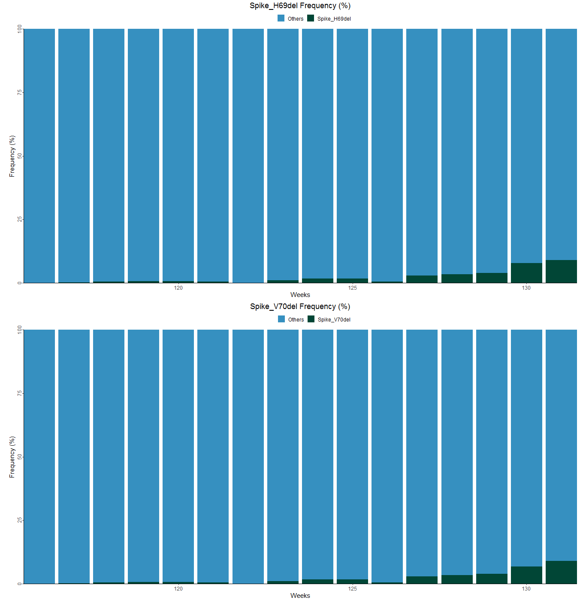
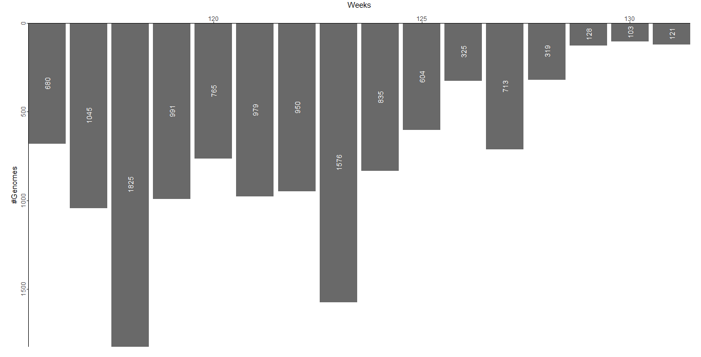
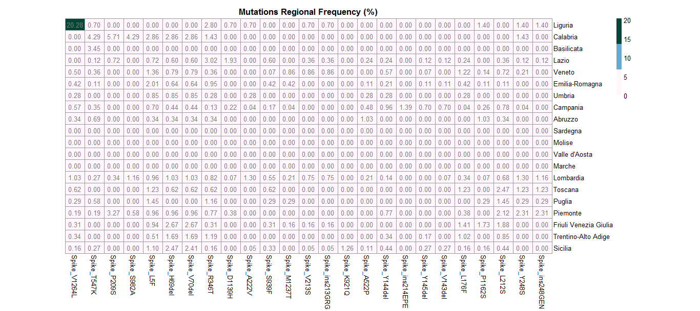
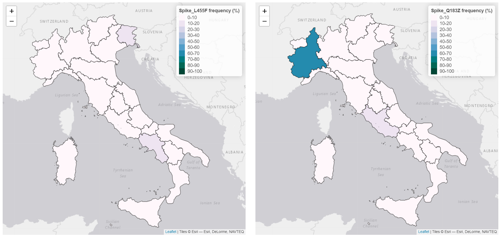

Mutations Tab
-------------

This tab describes the national and regional distribution of mutations for a user selected lineage over a time period of interest. Only lineages showing a frequency above the national global frequency threshold set in the Lineages Tab can be inspected. Similarly, for a selected lineage only non-defining mutations (frequency in the lineage >=1% but <50% in a specific country or locale for more than a week) can be visualised.

+ **National frequency barplot**
	| Describes variations in the relative pointwise frequency (%) of mutations of interest in the genomes from a selected lineage.
	| By default the two most frequent (%) non-defining mutations (based on relative global frequency at national level, limit set by the developer) are displayed.

+ **Sequenced genomes barplot**
	| Represents the total number of genomes sequenced weekly/monthly for the lineage of interest.

+ **Regional frequency heatmap**
	| Depicts variations in the relative global frequency (%, calculated at regional level) of non-defining mutations from a lineage of interest.
	| Only mutations that are present in at least one sequenced genome from the lineage of interest are represented.
	| To make the representation more compact and easily readable the number of elements to be visualised in the chart is limited to the first 25 most frequent mutations (based on national relative global frequency, limit set by the developer).

+ **Regional frequency choropleth map**
	| Represents variations in the relative global frequency (%, calculated at regional level) of a selected non-defining mutation from the lineage of interest.
	| Only mutations with a national relative global frequency (%) above a 1% threshold are represented.
	| Up to two choropleth maps, representing data for two different non-defining mutations from the lineage of interest, are displayed.

