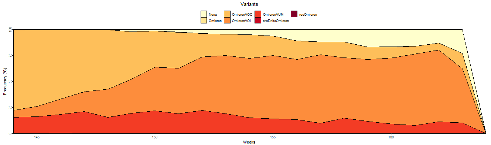
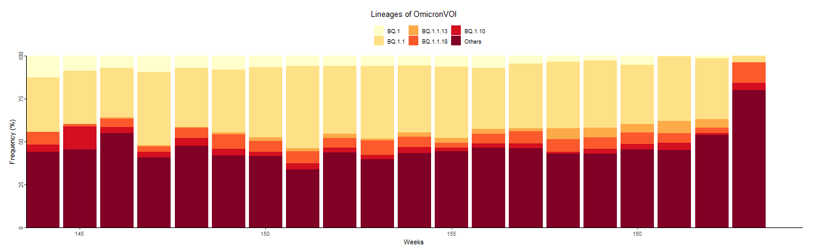
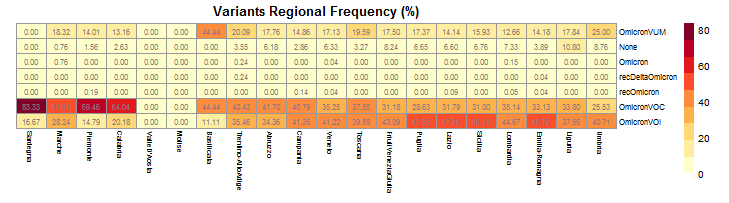
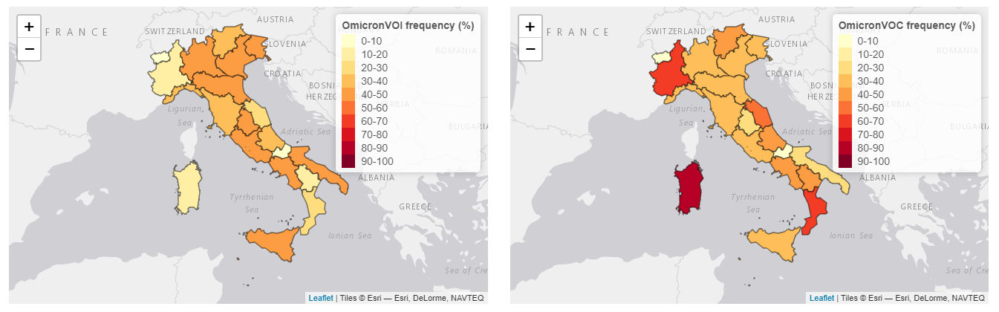

Variants Tab
------------

| This Tab consists of five types of plots which describe the national and regional distribution of SARS-CoV-2 variants over a time period of interest.
| The plot list includes:

+ **National frequency stacked area chart**
   | Describes the weekly variations in the national frequency (%) of variants belonging to a specific category (see following section) over a time period of interest. Frequency (%) is calculated as the ratio between the number of genomes for each variant and the total number of sequenced genomes, both calculated at national level on a weekly basis.\
   | Only variants that present at least one sequenced genome are represented.

+ **Sequenced genomes barplot**
   Represents the total number of SARS-CoV-2 genomes sequenced on each week in a time frame of interest.

.. figure:: _static/seqBP.PNG
   :scale: 50%
   :align: center

+ **Variants national composition barplot**
   | Describes the weekly variations in the “composition” of a variant from the category of interest over a specific time frame. Composition is defined as the evaluation of the national frequency (%) of each lineage belonging to the variant. Frequency (%) is calculated as the ratio between the number of genomes for each lineage of the variant of interest and the total number of sequenced genomes for that same variant, both calculated at national level on a weekly basis.
   | Only lineages with a national cumulative frequency (%) above a certain threshold (see following section) are represented. Cumulative frequency (%) is calculated as the ratio between the number of genomes for each lineage of the variant of interest and the total number of sequenced genomes for that same variant, both calculated at national level on the whole time period of interest. Moreover, to make the representation more compact and easily readable the number of elements to be visualised on the chart is limited to the first 5 most frequent lineages surviving previous filters (limit set by the developer).
   | All lineages not explicitly represented (either because they did not survive filters or they are not among the 5 most frequent) are aggregated under the “Others” variable.

+ **Regional frequency heatmap**
   | Represents the global variation in the regional cumulative frequency (%) of variants belonging to a specific category (see following section) over a time frame of interest. Cumulative frequency (%) is calculated as the ratio between the number of genomes for each variant of the category of interest and the total number of sequenced genomes, both calculated at regional level for the whole time period of interest.
   | Only variants that present at least one sequenced genome are represented.

+ **Regional frequency choropleth map**
   | Describes the regional cumulative frequency (%) of a selected variant over a time period of interest. Cumulative frequency (%) is calculated as the ratio between the number of genomes for the variant of interest and the total number of sequenced genomes, both calculated at regional level for the whole time period of interest.
   | Only variants that present at least one sequenced genome can be selected.
   | Two choropleth maps, representing data for two different variants, are available

