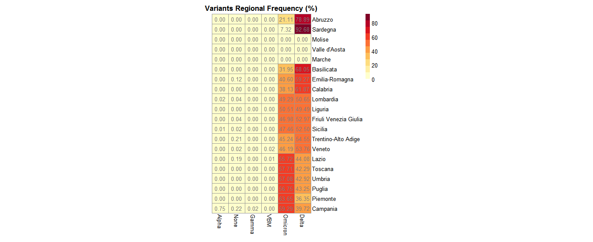

Variants Tab
------------

This tab describes the national and regional distribution of variants over a time period of interest.

+ **National frequency stacked area chart**
	| Describes variations in the pointwise frequency (%) of variants belonging to a specific category.
	| Only variants that present at least one sequenced genome are displayed.

+ **Sequenced genomes barplot**
	| Represents the total number of genomes sequenced weekly/monthly.

.. figure:: _static/LinVarSeqBP.png
   :scale: 75%
   :align: center

+ **Variants national composition barplot**
	| Illustrates variations in the “composition” of a variant in terms of lineages.
	| Composition is defined as the breakdown of the relative pointwise frequency (%) of each lineage belonging to the variant of interest.
	| Only lineages with a relative global frequency (%, calculated at national level) above a certain threshold are represented.
	| To make the representation more compact and easily readable the number of elements to be visualised in the plot is limited to the top 5 most prevalent lineages (based on relative global frequency, limit set by the developer).
	| All lineages not explicitly represented are aggregated under the label “Others”.

+ **Regional frequency heatmap**
	| Represents variations in the regional global frequency (%) of variants belonging to a specific category.
	| Only variants that present at least one sequenced genome are represented.

+ **Regional frequency choropleth map**
	| Displays variations in the regional global frequency (%) of a selected variant from a specific category.
	| Only variants that present at least one sequenced genome can be selected.
	| Up to two choropleth maps, representing data for two different variants, are displayed.

