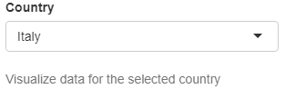
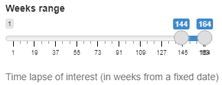

General
-------

This collection of widgets allows the personalisation of data and plots in all the tabs:

+ **Country**
   | Drop down menu that allows to select the country which data about SARS-CoV-2 variants, lineages and mutations distribution in space and time is analysed. Only countries with at least 1000 SARS-CoV-2 sequenced genomes can be selected.
   | *Default value*: Italy
   | *Controlled plots*: All

+ **Weeks range**
   | Slider that allows to select the time frame to analyse. Time points are defined as the number of weeks occurring from a fixed date selected by the developer (here 2019-12-30, the day of isolation of the first SARS-CoV-2 genome) while a time frame consists of the distance between two different time points. Both starting and ending points of the selection can be customised and the minimum time frame allowed is one week.
   | *Default value*:  last 20 weeks (about 5 months)
   | *Controlled plots*: All

