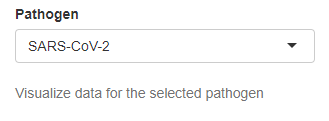
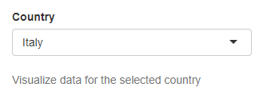
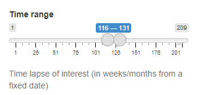

General
-------

The following settings are common to all panels and govern the first layer of data selection. This group of widgets impacts data selection throughout all the panels:

+ **Pathogen**
	| Selection of the pathogen for which data is displayed. Only one pathogen can be selected at a time.
	
	| *Type*: Drop down menu
	| *Default value*: SARS-CoV-2
	| *Controlled plots*: All

+ **Country**
	| Selection of the country. The list of available countries depends on pathogen selection and only countries with at least 1000 sequenced genomes for the pathogen of interest are included.
	
	| *Type*: Drop down menu
	| *Default value*: Depending on the user-selected pathogen
	| *Controlled plots*: All

+ **Time range**
	| Selection of the time interval to be displayed. Both starting and ending points of the selection can be set and the minimum selection allowed is 1 week/month. In mapPat time intervals are computed as the offset (in weeks or months) with respect to a fixed date, which is set for every pathogen in the ``PathogenSelection_ConfigTab.txt`` configuration file. The unit of time varies according to the availability of genomic sequences for the pathogen of interest. Currently, SARS-CoV-2 offsets are computed from 2019-12-30 (weeks) while 2022-01-01 is used for mPox (months).
	
	| *Type*: Slider
	| *Default value*: last 20 weeks/months
	| *Controlled plots*: All

