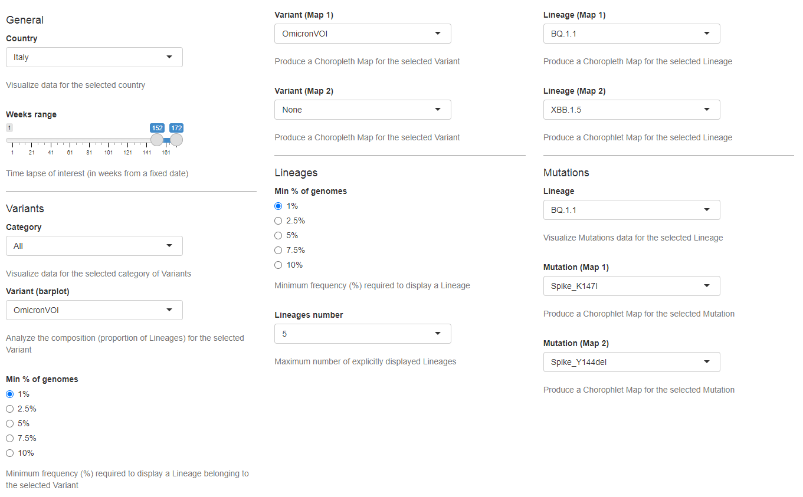

Data and plots customisation
----------------------------

| The behaviour of Tracker Name and the data displayed in each panel can be configured through a control panel, placed at the bottom of the interface, which collects multiple sets of widgets.
| Users can use these widgets to set a series of filters and/or selections that allow the persopnalisation of both data and plots behaviour, dynamically changing filtering and visualisation parameters. Once a selection is performed, Tabs are populated with plots accordingly.
| Some of the personalisation mechanisms collected by the control panel influence data/plots from different tabs, while others act specifically only on data/plots from certain Tabs.
| A complete list of all the widgets available in Tracker Name, organised by Tab of belonging and correlated by an exaustive description of their function and purpose, is available in the following sections of this manual.

