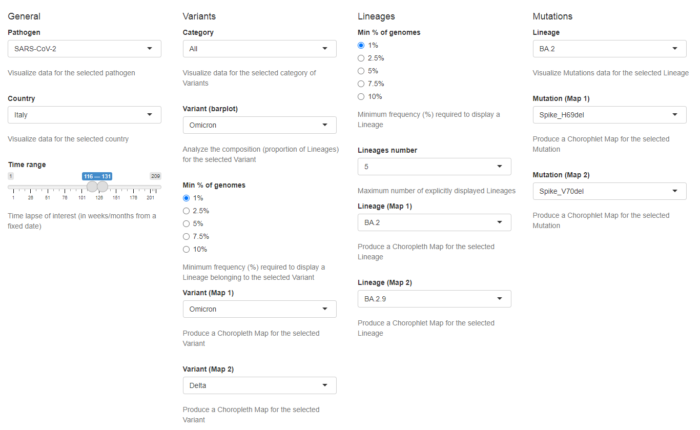

Data and plots customisation
----------------------------

| The behaviour of mapPat and the data displayed in each tab can be configured through the multiple widgets in the control panel at the bottom of the interface.
| Users can use these widgets to set a series of filters and selections that allow the customization of both data and plots behaviour, dynamically changing filtering and visualisation parameters. Once a selection is performed, tabs are populated with plots accordingly.
| Some settings influence data and plots from different tabs, while others act only on data and plots from a specific tab.
| A complete list of all the widgets available in mapPat, organised by tab and correlated by an exhaustive description of their function and purpose, is available in the following sections.
| Note that all widgets associated with the Variants Tab are available only for pathogens with named variants. At the moment this property applies only to SARS-CoV-2.

