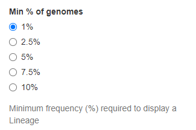
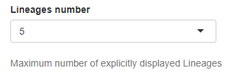
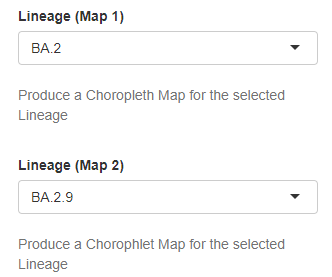

Lineages
--------

The following widgets allows the customisation of data from the Lineages Tab:

+ **Min % of genomes**
	| Selection of the minimum global prevalence (%, calculated at national level) required to consider a lineage for graphical representation. Only lineages with a frequency (%) above the selected threshold can be visualised. All remaining lineages are aggregated under the label “Others”. The available options are 1%, 2.5%, 5%, 7.5%, 10%.
	
	| *Type*: Radio buttons
	| *Default value*: 1%
	| *Controlled plots*: National frequency stacked area chart, Regional frequency choropleth map (Lineages Tab)

+ **Lineages number**
	| Selection of the maximum number *N* of lineages that are represented in plots. Lineages that are not included in the selection are aggregated under the label “Others”. The available options are integer numbers from 1 to 10.
	
	| *Type*: Drop down menu
	| *Default value*: 5
	| *Controlled plots*: National frequency stacked area chart (Lineages Tab)

+ **Lineage (Map 1)** and **Lineage (Map 2)**
	| Selection of up to 2 lineages to represent with choropleth maps. Only lineages with a frequency (%) above a user-selected threshold (see above) are available.
 
	| *Type*: Drop down menu
	| *Default value*: No (either first or second element automatically displayed to avoid repetition)
	| *Controlled plots*: Regional frequency choropleth map (Lineages Tab)

