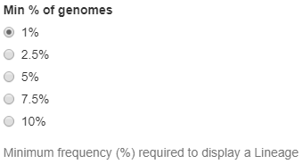
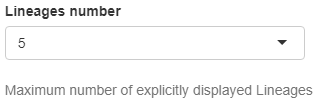
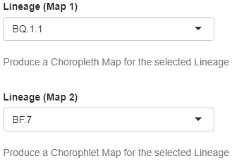

Lineages
--------

This collection of widgets allows the personalisation of data and plots in the Lineages Tab:

+ **Min % of genomes**
   | Radio buttons that allow to select the minimum frequency (%) required by a lineage to be represented, meaning that only lineages which frequency (%) is above the selected threshold can be explicitly plotted. All remaining lineages are aggregated under the “Others” variable (see paragraphs dedicated to controlled plots of the Lineages Tab in the previous section for further details). The available options are 1%, 2.5%, 5%, 7.5%, 10%.
   | *Default value*: 1%
   | *Controlled plots*: National frequency stacked area chart, Per lineage sequenced genomes scatterplot, Regional frequency choropleth map (Lineages Tab)

+ **Lineages number**
   | Drop down menu that allows to select the maximum number of lineages explicitly represented. Lineages that are not included in the selection are aggregated under the “Others” variable (see paragraphs dedicated to controlled plots of the Lineages Tab in the previous section for further details). The available options are integer numbers from 1 to 10.
   | *Default value*: 5
   | *Controlled plots*: National frequency stacked area chart, Per lineage sequenced genomes scatterplot (Lineages Tab)

+ **Lineage (Map 1) and Lineage (Map 2)**
   | Drop down menus that allow to select the lineages which regional cumulative frequency (%) is represented using a choropleth map (see paragraphs dedicated to controlled plots of the Lineages Tab in the previous section for further details). To be available in the menus lineages must have a national cumulative frequency (%) above the selected threshold (see above) in the time period of interest, meaning that the widget dynamically changes based on user-selection.
   | *Default value*: None (either first or second element automatically displayed to avoid repetition)
   | *Controlled plots*: Regional frequency choropleth map (Lineages Tab)

