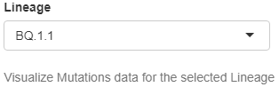
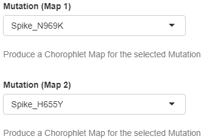

Mutations
---------

This collection of widgets allows the personalisation of data and plots in the Mutations Tab:

+ **Lineage**
   | Drop down menu that allows to select the lineage which non-defining mutations are analysed in the Mutations Tab. To be available in the menu lineages must have a national cumulative frequency (%) above the selected threshold (see above) in the time period of interest, meaning that the widget dynamically changes based on user-selection.
   | *Default value*: None (first element automatically displayed)
   | *Controlled plots*: All (except Sequenced genomes barplot, Mutations Tab)

+ **Mutation (Map 1) and Mutation (Map 2)**
   | Drop down menus that allow to select the mutations which regional cumulative frequency (%) is represented using a choropleth map (see paragraphs dedicated to controlled plots of the Mutations Tab in the previous section for further details). To be available in the menus mutations must have a national cumulative frequency (%) above 1% in the time period of interest and belong to the selected lineage (see above), meaning that the widget dynamically changes based on user-selection.
   | *Default value*: None (either first or second element automatically displayed to avoid repetition)
   | *Controlled plots*: Regional frequency choropleth map (Mutations Tab)

