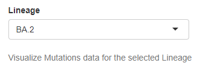
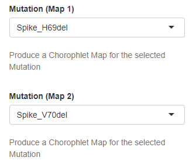

Mutations
---------

The following widgets set data selection for the Mutations Tab:

+ **Lineage**
	| Selection of the lineage for which non-defining mutations are displayed. Only lineages with a global frequency (%) at national level above a user-selected threshold (see previous section) are available for selection.
 
	| *Type*: Drop down menu
	| *Default value*: No (first element automatically displayed)
	| *Controlled plots*: All (except Sequenced genomes barplot, Mutations Tab)

+ **Mutation (Map 1)** and **Mutation (Map 2)**
	| Selection of up to 2 mutations to represent using choropleth maps. Only mutations from the user-selected lineage (see above) with a relative global frequency (%, calculated at national level) above 1% are available.
 
	| *Type*: Drop down menu
	| *Default value*: No (either first or second element automatically displayed to avoid repetition)
	| *Controlled plots*: Regional frequency choropleth map (Mutations Tab)

