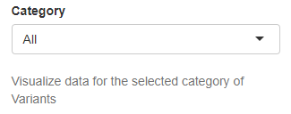
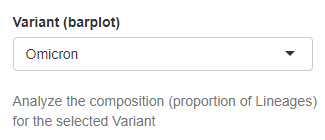
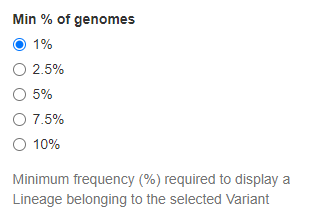
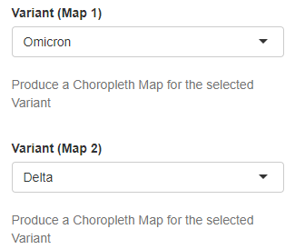

Variants
--------

The following group of widgets govern data selection in the Variants Tab:

+ **Category**
	| Selection of the class of variants to be displayed. The available options are All, VOC, VOI, VBM and None. This classification includes all the variants that were labelled with a greek alphabet letter by WHO at any time throughout the COVID-19 pandemic. The VBM category allows to align this nomenclature with the current World Health Organisation (WHO) guidelines for SARS-CoV-2 variants classification: being Omicron the only SARS-CoV-2 variant circulating worldwide at present, its lineages can be flagged as Variants Being Monitored (VBM) based on their potential treat for public health.
	
	| *Type*: Drop down menu
	| *Default value*: All
	| *Controlled plots*: All (except Sequenced genomes barplot, Variants Tab)

+ **Variant (barplot)**
	| Selection of a specific variant. The prevalence of the circulating lineages associated with the selected variant is displayed in the form of a barplot. Only variants from the category of interest (see above) and with at least one sequenced genome can be chosen.
	
	| *Type*: Drop down menu
	| *Default value*: No (first element automatically displayed)
	| *Controlled plots*: Variants national composition barplot (Variants Tab)

+ **Min % of genomes**
	| Selection of the minimum relative global prevalence (%, calculated at national level) required to consider a lineage from the user-selected variant (see above) for graphical representation. Only lineages which frequency (%) is above the selected threshold are represented. All remaining lineages are aggregated under the label “Others”. The available options are 1%, 2.5%, 5%, 7.5%, 10%.
	
	| *Type*: Radio buttons
	| *Default value*: 1%
	| *Controlled plots*: Variants national composition barplot (Variants Tab)

+ **Variant (Map 1)** and **Variant (Map 2)**
	| Selection of up to 2 variants to represent in choropleth maps. Only variants from the user-selected category (see above) and with at least one sequenced genome are available for selection.
	
	| *Type*: Drop down menu
	| *Default value*: No (either first or second element automatically displayed to avoid repetition)
	| *Controlled plots*: Regional frequency choropleth map (Variants Tab)

