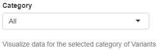
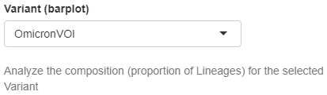
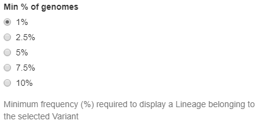

Variants
--------

This collection of widgets allows the personalisation of data and plots in the Variants Tab:

+ **Category**
   | Drop down menu that allows to select a specific group of variants to be analysed. The available options are All, VOC, VOI, VUM, OmicronVOC, OmicronVOI, OmicronVUM, Recombinant and None. For the sake of completeness this classification includes in a certain category all the variants that were assigned to it at any time point during SARS-CoV-2 evolution. The OmicronVOC, OmicronVOI, OmicronVUM categories allow to align this grouping method to the World Health Organisation (WHO) guidelines about SARS-CoV-2 variants classification: the latter, in fact, currently categorises as VOC, VOI or VUM only lineages belonging to the Omicron variant which is the only SARS-CoV-2 variant circulating worldwide.
   | *Default value*: All
   | *Controlled plots*: All (except Sequenced genomes barplot, Variants Tab)

+ **Variant (barplot)**
   | Drop down menu that allows to select a variant which composition is evaluated (see paragraphs dedicated to controlled plots of the Variants Tab in the previous section for further details). To be available in the menu variants must have at least one sequenced genome in the time period of interest and belong to the selected category (see above), meaning that the widget dynamically changes based on user-selection.
   | *Default value*: None (first element automatically displayed)
   | *Controlled plots*: Variants national composition barplot (Variants Tab)

+ **Min % of genomes**
   | Radio buttons that allow to select the minimum frequency (%) required by a lineage from the selected variant (see above) to be represented, meaning that only lineages which frequency (%) is above the selected threshold can be explicitly plotted. All remaining lineages are aggregated under the “Others” variable (see paragraphs dedicated to controlled plots of the Variants Tab in the previous section for further details). The available options are 1%, 2.5%, 5%, 7.5%, 10%.
   | *Default value*: 1%
   | *Controlled plots*: Variants national composition barplot (Variants Tab)

+ **Variant (Map 1) and Variant (Map 2)**
   | Drop down menus that allow to select the variants which regional cumulative frequency (%) is represented using a choropleth map (see paragraphs dedicated to controlled plots of the Variants Tab in the previous section for further details). To be available in the menus variants must have at least one sequenced genome in the time period of interest and belong to the selected category (see above), meaning that the widget dynamically changes based on user-selection.
   | *Default value*: None (either first or second element automatically displayed to avoid repetition)
   | *Controlled plots*: Regional frequency choropleth map (Variants Tab)

.. figure:: _static/varWidg_VarCM.PNG
   :scale: 50%
   :align: center